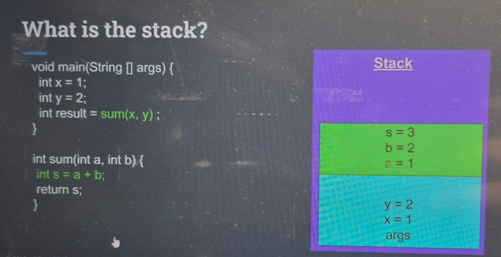
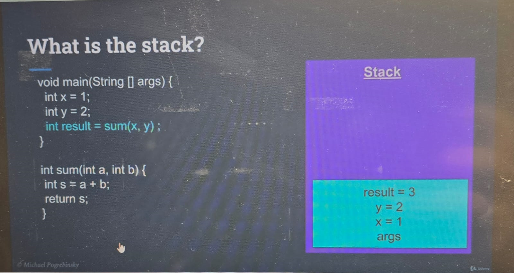

**Context Switching**

Switching between multiple threads.

It's expensive in case of many threads

we have multiple process and each process has multiple threads.

Switching between threads of a multiple process is more time-consuming and expensive then switching within Threads of same process.

one process can be running videos on media player, another process can be writing data on notepad.

Implementation :

1. Implement Runnable method - Runnable
2. Extend Thread -ExtendsThread

**Case Study**

Make a system having username and password
Hacker thread to break the system 
Police thread to catch system 10 sec show progress of arrival on screen

**Interrupt**
Thread A can interrupt thread B, or we can stop long-running thread through interrupt

To check whether anyone called thread to interrupt
**if(Thread.currentThread().isInterrupted()){}**

**Damon Thread**
Background threads that do not prevent the application from existing if the main thread terminates

When to use Damon Thread

1.Background task that should not block our application to terminate. For Example File saving in text editor
2.Code in worker thread is not in our control, and we don't want it to block our applcoation from terminate. For example Third part libraries.

**Join Thread / Thread coordination**
Make sure dependent thread completes the work before another thread starts

Implementation

1. Result print in FactorialThread
2. How to read variable of threaded class in another class using thread
   FactorialThread factorial = (FactorialThread) threads.get(i);
3. Implement isFinished to print value if finished
  **Problem**: this introduces race condition since start method starting thread and finished method trying to print as soon as possible
4. To remove race condition, we added join
    thread.join() this makes thread dependent on each other.
    **Problem**: if one thread is taking more than expected time, then the main thread will keep on waiting
5. How long we are willing to wait for each thread to complete the task
     thread.join(2000);//time is in milliseconds


## DATA SHARING BETWEEN THREAD

### Stack Memory Region

What is stack?
Memory region where
*     Methods are called
*     Arguments are passed
*     Local Variables are stored
Stack+instruction pointer = State of each thread's execution




**Stack Properties**
1. Each stack region belongs to a particular thread
2. All variables belong to the thread executed on that stack. other threads cannt access them.
3. Stack is allocated Statically when a thread is created, 
4. Stack size is fixed and cannt change at run time
5. If memory hierarchy is too deep. We may get an Stackoverflow Exception. (Risky with recursive call)

### Heap Memory Region
* Shared memory region

What is allocated over heap?
* Objects-Anything created by new operator like String, Object, collections...
* Members of class

  ```
  class MyClass {
     MyObject memberObject; // Class member object reference

     MyClass() {
         memberObject = new MyObject(); // Initializing the member object
     }
  
     void myMethod() {
         MyObject localObject = new MyObject(); // Non-class member object reference
         // localObject can only be used within this method
     }
  }
* Static variables - these are class variables.

Heap Memory Management
* Managed by Garbage Collector
* Objects stay as long as we have one reference of them.
* Members of class exist as long as parent of class exists.
* Static Variables—Stay Forever.

**Reference Variables and Objects**
1.   Reference variables are stored in **STACK**
2.   Reference variable of class member stored in **HEAP**
3.   Objects always stored in **HEAP**

## Resource Sharing between Threads
What are resources?
* Variables
* Any Objects
* File or connection handles
* Data Structure
* Message queue

Why do we need to share resources?

Example text editor — one thread is handing an ui task and another thread is handling saving data at particular time.
                    Both threads have common (shared) file to work and that file is stored in any DS which is shared between two threds

Another common example is database—One db is shared by multiple thread to do read and write operations

What is the problem in shared resources?

Increment value and decrement same value.

    public class IncrementDecrement {

        public static void main(String[] args) throws InterruptedException {
            //constructor
            InventoryCounter inventoryCounter = new InventoryCounter();
            IncrementNumber inc = new IncrementNumber(inventoryCounter);
            DecrementNumber dec = new DecrementNumber(inventoryCounter);
    
            inc.start(); //start the thread
            inc.join();//finished the thread
            dec.start();//start the thread
            dec.join();//finished the thread
            System.out.println("Result of sequential threading "+inventoryCounter.getItems());
    
            InventoryCounter inventoryCounter1 = new InventoryCounter();
            IncrementNumber inc1 = new IncrementNumber(inventoryCounter1);
            DecrementNumber dec1 = new DecrementNumber(inventoryCounter1);
    
            inc1.start(); //start the thread
            dec1.start();//start the thread
            inc1.join();//finished the thread
            dec1.join();//finished the thread
    
            System.out.println("Result of multi threading "+inventoryCounter1.getItems());
    
        }
    
        public static class InventoryCounter {
            private int items = 0;
    
            public void increment() {
                items++;
            }
    
            public void decrement() {
                items--;
            }
    
            public int getItems() {
                return items;
            }
        }
    
        public static class IncrementNumber extends Thread{
    
            InventoryCounter increment;
            public IncrementNumber(InventoryCounter increment){
                this.increment = increment;
            }
    
            @Override
            public void run() {
                for(int i=0;i<1000;i++){
                increment.increment();}
            }
        }
    
        public static class DecrementNumber extends Thread{
    
            InventoryCounter increment;
            public DecrementNumber(InventoryCounter increment){
                this.increment = increment;
            }
    
            @Override
            public void run() {
                for(int i=0;i<1000;i++){
                increment.decrement();}
            }
        }
    }
Output:

Result of sequential threading 0
Result of multi threading 36

Problems:
1. Two thread sharing items counter
2. Both threads are reading and modifying the counter at the same time.
3. Operations are not atomic.


**Atomic Operations**
* Appears at once.
* Single step operation—all or nothing
* No intermediate states

items++ is not atomic since have multiple steps involved in it
1. read current value
2. increment modify value
3. store modified value back to variable. 


# Concurrency Challenges and Solutions
Below is the condition that causes synchronization problem:
1. critical section — In case of no atomic operations, one thread can enter into a critical section, and another thread needs to wait until the first thread crosses the critical section.
   By this way we can maintain the concurrency
2. Race condition
3. Preemption—if thread in a critical section and cpu pause(preempted) the thread and start the another thread to work on critical section. In this case also results get wrong
**Critical Section**
In case of no atomic operations, one thread can enter into a critical section, and another thread needs to wait until the first thread crosses the critical section.
By this way we can maintain the concurrency


Problems in the above code are as follows:
1. Two thread sharing items counter
2. Both threads are reading and modifying the counter at the same time.
3. Operations are not atomic.


**Mutex**
Lock the critical section 
`Lock lock= new ReenteredLcok();`
pass this lock to a critical section

Solutions 1: **Synchronized**
1. Java provide locking mechanism
2. Used to restrict the entire section or critical section to single thread at a time.

There are two ways to use Synchronized Keyword
1. **Synchronized - Monitor**
    One or more methods of a class using synchronized
    
   ```
   public class ABC{
        public synchronized method1(){
        .....
        }

        public synchronized method2(){
        .....
        }
    }
Problem:
If thread A accessing method 1 then thread B cannt access any method of that class as both methods are locked.

    public class Monitor {

        public static void main(String[] args) throws InterruptedException {
            //constructor
            InventoryCounter inventoryCounter = new InventoryCounter();
            IncrementNumber inc = new IncrementNumber(inventoryCounter);
            DecrementNumber dec = new DecrementNumber(inventoryCounter);
    
            inc.start(); //start the thread
            dec.start();//start the thread
            inc.join();//finished the thread
            dec.join();//finished the thread
            System.out.println("Result of Mutiple threading in sychronized way "+inventoryCounter.getItems());
    
    
        }
    
        public static class InventoryCounter {
            private int items = 0;
    
            public synchronized void increment() {
                items++;
            }
    
            public synchronized void decrement() {
                items--;
            }
    
            public synchronized int getItems() {
                return items;
            }
        }
    
        public static class IncrementNumber extends Thread{
    
            InventoryCounter increment;
            public IncrementNumber(InventoryCounter increment){
                this.increment = increment;
            }
    
            @Override
            public void run() {
                for(int i=0;i<1000;i++){
                increment.increment();}
            }
        }
    
        public static class DecrementNumber extends Thread{
    
            InventoryCounter increment;
            public DecrementNumber(InventoryCounter increment){
                this.increment = increment;
            }
    
            @Override
            public void run() {
                for(int i=0;i<1000;i++){
                increment.decrement();}
            }
        }
    }

2. **Synchronized-Lock**
    Lock the critical section not complete method.

    Advantage: 
   1. Two threads can access two different methods having a critical section without blocking all methods which we are doing in the previous case.
   2. We are locking critical code only rest code can be accessed by muti threads 
   3. Increase performance.
   
    Syntax:


    Object lockingObject = new Object();
    public void method{
        .....
        ......
        synchronized(lockingObject){
        //critical section
        }
        ....
        ....
    }

package Threading.ResourceSharing;

    public class Lock {

        public static void main(String[] args) throws InterruptedException {
            //constructor
            InventoryCounter inventoryCounter = new InventoryCounter();
            IncrementNumber inc = new IncrementNumber(inventoryCounter);
            DecrementNumber dec = new DecrementNumber(inventoryCounter);
    
            inc.start(); //start the thread
            dec.start();//start the thread
            inc.join();//finished the thread
            dec.join();//finished the thread
            System.out.println("Result of Mutiple threading in sychronized way "+inventoryCounter.getItems());
    
    
        }
    
        public static class InventoryCounter {
            private int items = 0;
    
            Object lock = new Object();
            public  void increment() {
                System.out.println("Incrementing");
                synchronized (lock) {items++;}
    
            }
    
            public  void decrement() {
                System.out.println("Decrementing");
                synchronized (lock) {items--;}
            }
    
            public  int getItems() {
                return items;
            }
        }
    
        public static class IncrementNumber extends Thread{
    
            InventoryCounter increment;
            public IncrementNumber(InventoryCounter increment){
                this.increment = increment;
            }
    
            @Override
            public void run() {
                for(int i=0;i<1000;i++){
                increment.increment();}
            }
        }
    
        public static class DecrementNumber extends Thread{
    
            InventoryCounter increment;
            public DecrementNumber(InventoryCounter increment){
                this.increment = increment;
            }
    
            @Override
            public void run() {
                for(int i=0;i<1000;i++){
                increment.decrement();}
            }
        }
    }

**Atomic Operations**
1. All assignments are atomic.
2. All getters and setters are atomic. Since we are assigning values only.
3. All primitive types are atomic except double and long.
4. Double and long also became atomic after declaring a volatile keyword
    volatile double x=1.0;

Atomic use case Implement Metric

    public class Atomic {

        public static void main(String[] args) {
            Metric metric = new Metric();
            BusinessLogic businessLogic = new BusinessLogic(metric);
            BusinessLogic businessLogic2 = new BusinessLogic(metric);
            MetricPrinter metricPrinter = new MetricPrinter(metric);
    
            businessLogic.start();
            businessLogic2.start();
            metricPrinter.start();
        }
    
        public static class MetricPrinter extends Thread {
            Metric metric;
    
            public MetricPrinter(Metric metric){
                this.metric = metric;
            }
    
            @Override
            public void run() {
             while(true){
                 System.out.println(metric.getAverage());
             }
            }
    
        }
    
        public static class BusinessLogic extends Thread {
            Metric metric;
            Random random= new Random();
    
            public BusinessLogic(Metric metric) {
                this.metric=metric;
            }
    
            @Override
            public void run() {
                while (true) {
                    long startTime = System.currentTimeMillis();
                    try {
                        Thread.sleep(random.nextInt(1000));
                    } catch (InterruptedException e) {
                        throw new RuntimeException(e);
                    }
                    long endTime = System.currentTimeMillis();
                    metric.addSample(endTime - startTime);
                }
            }
        }
    
    
        public static class Metric {
            private volatile long count=0;
            private volatile double average=0.0;
    
            public synchronized void addSample(long sample){
                double currentSample= average*count;
                count++;
                average=(currentSample+sample)/count;
            }
    
            public double getAverage(){
                return average;
            }
    
    
        }
    }

Use case
A stock trading application that keeps track of the minimum and maximum price of the stock daily.

**Race Condition:**

1. Condition when multiple threads are accessing a shared resource.
2. At least one thread is modifying the resource.
3. the timing of thread scheduling may cause an incorrect result.
4. The core problem is non-atomic operations performed on shared resource.

**Data Race**


    public class DataRace {

        public static void main(String[] args) {
           RaceCondition raceCondition = new RaceCondition();
           Thread th = new Thread(() -> {
               for(int i=0;i<Integer.MAX_VALUE;i++){
                   raceCondition.increment();
               }
           });
    
           Thread th1 = new Thread(() -> {
               for(int i=0;i<Integer.MAX_VALUE;i++){
                   raceCondition.checkForDataRace();
               }
           });
    
           th.start();
           th1.start();
    
        }
    
        public static class RaceCondition{
            private int x=0;
            private int y=0;
    
            public void increment(){
                x++;
                y++;
            }
    
            public void checkForDataRace(){
                if(y>x){
                    System.out.println("Data Race condition exists x="+x+" y="+y);
                }
            }
        }
    }

## Semaphore
1. It Can be used to restrict the number of users to a particular resource or group of resources.
2. Unlike the lock that allows **one number of users** to a resource. Semaphore can restrict **any number of users** to a resource.

#### Difference between Semaphore and Lock
1. Semaphore does not know the owner of thread
    1.  Many threads can acquire a permit
    2.  The Same thread can acquire the semaphore multiple time
2. Semaphore can be released by any thread.
    1. even thread didnt acquire it.
    2. Two threads can enter a critical section that introduces BUG in a system

Semaphore can't eliminate Thread locking. it can be used for producer and consumer problem

Solution of above problem is add volatile keyword in x,y
`       private  volatile int x=0;
    private  volatile int y=0;`